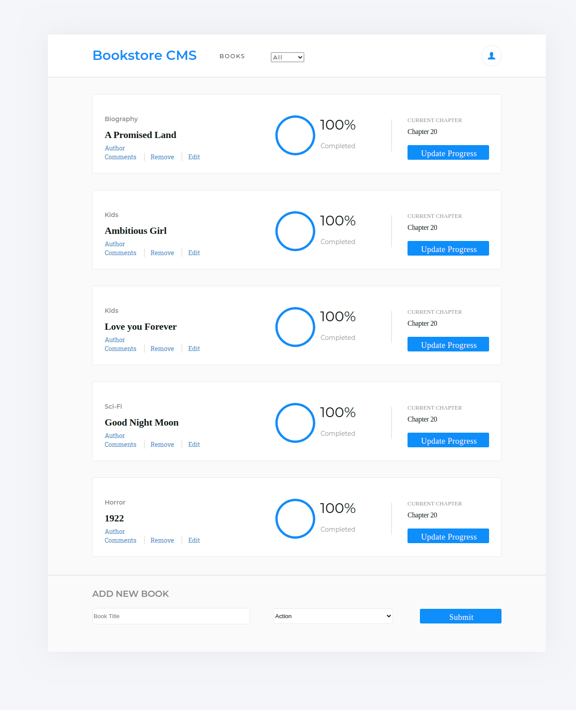

<h1 align="center"> Magic Books </h1>

> The requirement for this project is to build the front-end of an application that will help companies organize and manage their bookstore. It needs to be fast, dynamic and responsive to their actions and therefore, the project will be developed using React & Redux.

### Deployment

[Click Here for a Live Version of the Project](https://booksmagic.herokuapp.com/)

## Development

### #1 Milestone Requirements:
 - Initiate Documentation
 - Initiate React Application
 - Set the main tools (Redux, React-Redux, Redux Toolkit and NPM)
 - Deploy the application

### #2 Milestone Requirements:

 - Set files and folders structure, dividing, reducers, actions, containers and presentational components.
 - Index renders App component, which wraps BookList and BookForm
 - Booklist fetch the store to grab the books and display them on a table, where each book is represented in a row.
 - Book component presents a book and receives a book as prop.
 - BookForm contains a text input and a select box for the category. The options should be generated by a constant array that stores the categories.
 - Build books reducer that handle CREATE_BOOK and REMOVE_BOOK actions
 - Set CREATE_BOOK and REMOVE_BOOK actions.
 - Set store with an initial state.
 - Pass the store to App component using Provider.

### #3 Milestone Requirements:

 - Make BookForm Component Stateful.
 - State is updated when fields change.
 - Add a column to BookList table with remove buttons
 - HandleRemoveBook function reacts to onClick event and removes the book from the store.

 ### #4 Milestone Requirements:

  - Build a presentational component called CategoryFilter
  - Build a new redux reducer to set a book filter
  - Define an action to set the filter
  - User can filter books displayed by category using a select box

### #5 Milestone Requirements:

  - Improve the UI
  - Style Elements
  - Building placeholders for future implementation

## Built With

- Javascript
- React
- Redux
- React-Redux
- Redux Toolkit
- NPM

## Prerequisites

- Using NPM package and JavaScript knowledge to run and make changes in that project.
- You should install Node.js to run the server with the dependency used. If you don't have Node you can follow this tutorial to set it on your local machine: [HERE](https://www.w3schools.com/nodejs/default.asp)

## Getting Started

To get a local copy of this project running follow these simple steps.

- Clone this repository
 > `git clone <repo>`
- Navigate to the Repo Folder
- To set Webpack and the dependencies run the command
> `npm install`
- Use the command below to start the server. 
> `npm start`
- Use your favorite browser to open http://localhost:3000 to view it in the browser.

## Authors

👤 **Marilena Roque**

- Github: [MarilenaRoque](https://github.com/MarilenaRoque)
- Twitter: [@MariRoq88285995](https://twitter.com/MariRoq88285995)
- Linkedin: [roquemarilena](https://www.linkedin.com/in/roquemarilena/)

## 🤝 Contributing

Contributions, issues and feature requests are welcome!

Feel free to check the [issues page](issues/).

## Show your support

Give a ⭐️ if you like this project!